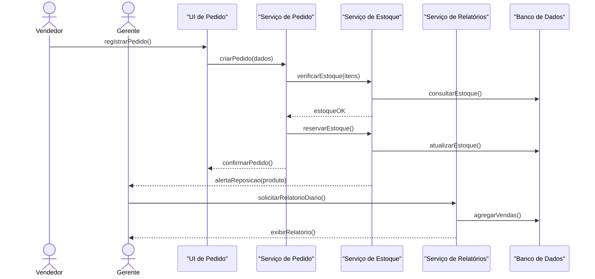
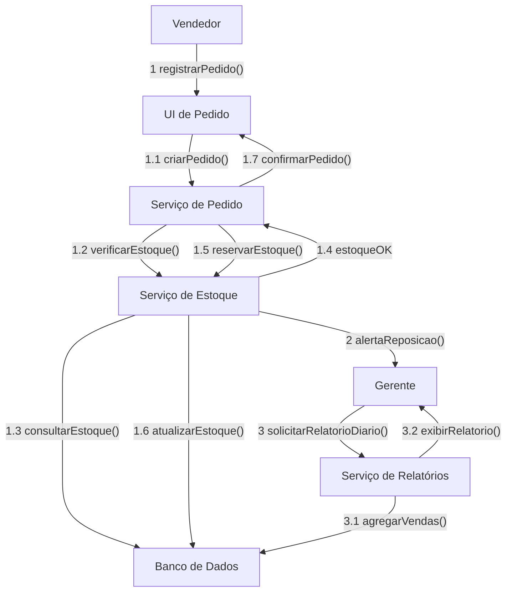

```mermaid
sequenceDiagram
    actor Vendedor
    actor Gerente
    participant UI           as "UI de Pedido"
    participant PedidoSvc    as "Serviço de Pedido"
    participant EstoqueSvc   as "Serviço de Estoque"
    participant RelatorioSvc as "Serviço de Relatórios"
    participant BD           as "Banco de Dados"

    Vendedor   ->> UI           : registrarPedido()
    UI         ->> PedidoSvc    : criarPedido(dados)
    PedidoSvc  ->> EstoqueSvc   : verificarEstoque(itens)
    EstoqueSvc ->> BD           : consultarEstoque()
    EstoqueSvc -->> PedidoSvc   : estoqueOK
    PedidoSvc  ->> EstoqueSvc   : reservarEstoque()
    EstoqueSvc ->> BD           : atualizarEstoque()
    PedidoSvc  -->> UI          : confirmarPedido()

    EstoqueSvc -->> Gerente     : alertaReposicao(produto)

    Gerente    ->> RelatorioSvc : solicitarRelatorioDiario()
    RelatorioSvc ->> BD         : agregarVendas()
    RelatorioSvc -->> Gerente   : exibirRelatorio()
```

```mermaid
flowchart TD
    %% Objetos / Atores
    Vendedor["Vendedor"]
    UI["UI&nbsp;de&nbsp;Pedido"]
    PedidoSvc["Serviço&nbsp;de&nbsp;Pedido"]
    EstoqueSvc["Serviço&nbsp;de&nbsp;Estoque"]
    BD["Banco&nbsp;de&nbsp;Dados"]
    Gerente["Gerente"]
    RelatorioSvc["Serviço&nbsp;de&nbsp;Relatórios"]

    %% Mensagens do fluxo de pedido
    Vendedor  -- "1&nbsp;registrarPedido()"     --> UI
    UI        -- "1.1&nbsp;criarPedido()"       --> PedidoSvc
    PedidoSvc -- "1.2&nbsp;verificarEstoque()"  --> EstoqueSvc
    EstoqueSvc-- "1.3&nbsp;consultarEstoque()"  --> BD
    EstoqueSvc-- "1.4&nbsp;estoqueOK"          --> PedidoSvc
    PedidoSvc -- "1.5&nbsp;reservarEstoque()"   --> EstoqueSvc
    EstoqueSvc-- "1.6&nbsp;atualizarEstoque()"  --> BD
    PedidoSvc -- "1.7&nbsp;confirmarPedido()"   --> UI

    %% Alerta de reposição
    EstoqueSvc -- "2&nbsp;alertaReposicao()"    --> Gerente

    %% Relatório diário
    Gerente     -- "3&nbsp;solicitarRelatorioDiario()" --> RelatorioSvc
    RelatorioSvc-- "3.1&nbsp;agregarVendas()"   --> BD
    RelatorioSvc-- "3.2&nbsp;exibirRelatorio()" --> Gerente
```
