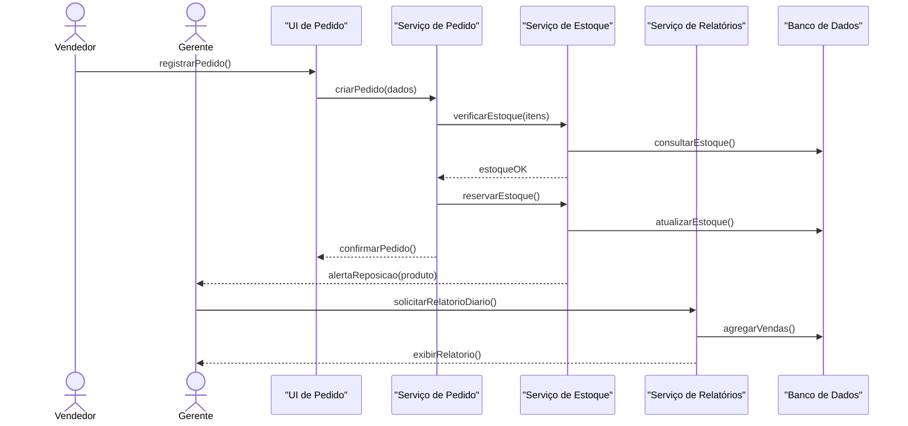

```mermaid
sequenceDiagram
    actor Vendedor
    actor Gerente
    participant UI           as "UI de Pedido"
    participant PedidoSvc    as "Serviço de Pedido"
    participant EstoqueSvc   as "Serviço de Estoque"
    participant RelatorioSvc as "Serviço de Relatórios"
    participant BD           as "Banco de Dados"

    Vendedor   ->> UI           : registrarPedido()
    UI         ->> PedidoSvc    : criarPedido(dados)
    PedidoSvc  ->> EstoqueSvc   : verificarEstoque(itens)
    EstoqueSvc ->> BD           : consultarEstoque()
    EstoqueSvc -->> PedidoSvc   : estoqueOK
    PedidoSvc  ->> EstoqueSvc   : reservarEstoque()
    EstoqueSvc ->> BD           : atualizarEstoque()
    PedidoSvc  -->> UI          : confirmarPedido()

    EstoqueSvc -->> Gerente     : alertaReposicao(produto)

    Gerente    ->> RelatorioSvc : solicitarRelatorioDiario()
    RelatorioSvc ->> BD         : agregarVendas()
    RelatorioSvc -->> Gerente   : exibirRelatorio()
```
